If you add absolute positioning to an element with display: inline-flex, it will become block-level (like display: flex), but will still generate a flex formatting context.

If you add absolute positioning to an element with display: flex, it will be sized using the shrink-to-fit algorithm (typical of inline-level containers) instead of the fill-available one.
[ref](https://stackoverflow.com/questions/41033245/does-position-absolute-conflict-with-flexbox)
[Abrí una pregunta en stackoverflow](https://stackoverflow.com/questions/79684809/flexbox-justify-contentspace-between-doesnt-work-properly-with-positionabsolu/79684870#79684870)

[text-decoration: none;](https://www.w3schools.com/css/css_link.asp)

### Filtros en JSX
https://youtu.be/94CVSF0Gr-w?si=m8wHy1c7KEDO_NXq

https://github.com/urian121/checkbox-filters-with-reactjs/blob/master/src/components/ApiProducts.jsx
https://www.dhiwise.com/post/mastering-the-art-of-separating-ui-and-logic-in-react 
https://codesandbox.io/p/sandbox/react-separation-of-concern-3vxv1?file=%2Fsrc%2Fhelper.js%3A6%2C1
https://stackoverflow.com/questions/69332889/reactjs-separation-of-ui-and-business-logic
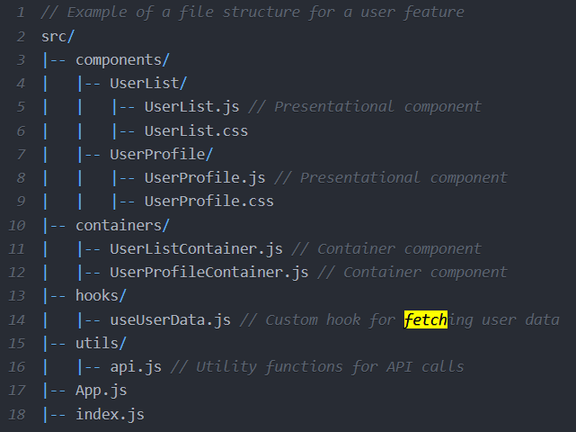

Preguntas internas que he tenido que resolver/refrescar para continuar con el proyecto, dado que estoy adaptandome a NEXT.js sobre la marcha, siempre he usado create-react-app.

¿Cómo traía datos de una carpeta public?
Desde "/public"

¿Cómo se renderiza/recorre un arreglo?
Necesitaba indicar el return en el map

Necesito un context, porque necesito consumir de distintas partes la api

Necesito preguntar por el estado de los checkboxs, para realizar filtros.
| Formularios en React | Estado de inputs
Búsqueda: estado seleccionado de un input 
https://developer.mozilla.org/es/docs/Web/HTML/Reference/Elements/input#ejemplo_2_escenario_de_uso_com%C3%BAn

* https://es.react.dev/reference/react-dom/components/input
> Necesitas leer e.target.checked en vez de e.target.value para checkboxes.

* https://www.geeksforgeeks.org/reactjs/reactjs-checked-attribute/
> How React Handles the checked Attribute?
In React, form elements such as checkboxes and radio buttons can be controlled components, meaning their value (checked or unchecked) is controlled by the component’s state. Instead of relying on the static HTML checked attribute, React uses a combination of the checked property and state to manage the form element’s state dynamically.
In React, you don't simply use checked like in HTML. Instead, you tie the checked property of the input element to the component's state, which reflects whether the checkbox or radio button is selected.

* https://www.freecodecamp.org/espanol/news/a-continuacion-vamos-a-establecer-que-el-valor-totalprice-al-estado-total-utilizando-settotal-totalprice/
* https://codesandbox.io/p/sandbox/mystifying-tu-xlpgb?file=%2Fsrc%2Futils%2Ftoppings.js
* https://b8k2j.csb.app/
> En React, los Inputs Controlados se manejan mediante el estado, por lo que solamente podemos cambiar el  valor del input cambiando su estado.
> Antes, cuando teníamos un solo casilla de verificación, solo teníamos el estado isChecked para cambiar el estado de la casilla de verificación. Pero ahora, como tenemos varias casillas de verificación, no es práctico hacer varios llamados useState para cada uno.Entonces, declaremos un arreglo dentro del estado e indiquemos el estado de cada una de las casillas de verificación. Para crear un arreglo cuyo largo sea igual número de casillas de verificación

* https://stackoverflow.com/questions/68214703/filter-fetch-data-to-checkboxes-react-js
filter fetch data to checkboxes react js
* https://github.com/VictoriaIleanaRodriguezMora/ecommerce-react/blob/main/src/components/asynckmock.js

SPREAD OPERATOR

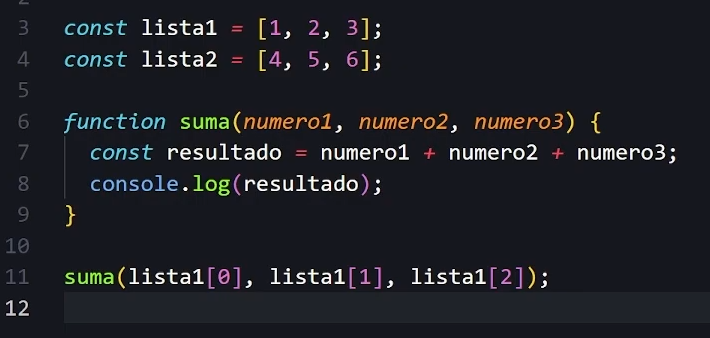
El resultado no varía
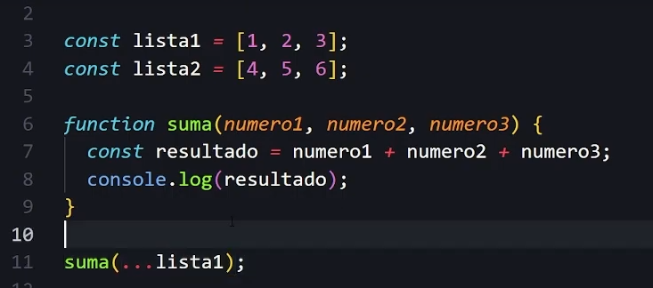
REST N OPERATOR
parametros:
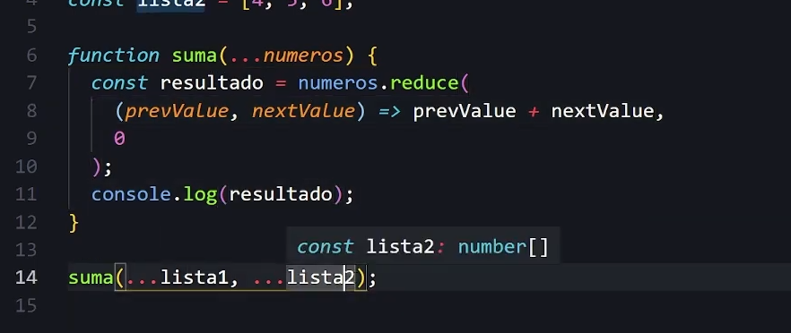

Midu:
Copia por valor
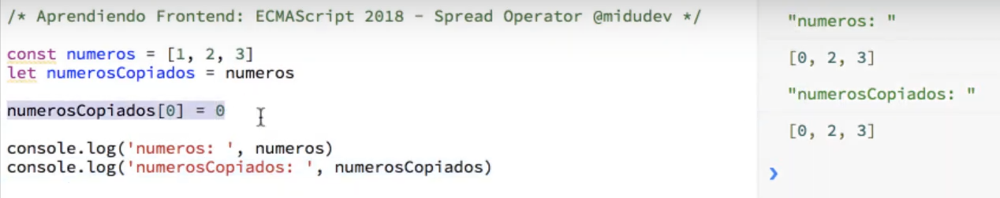 
Copia por referencia
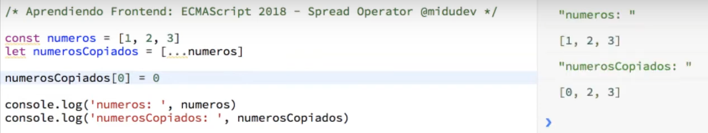

Obj
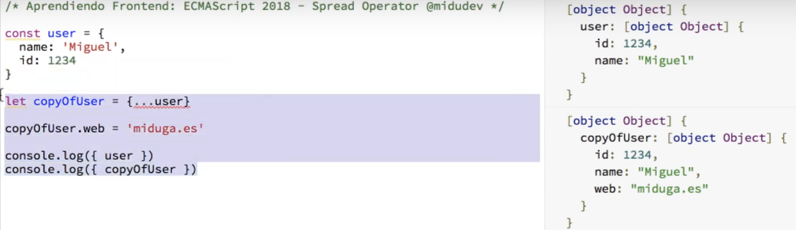
Obj | Cambiar una propiedad
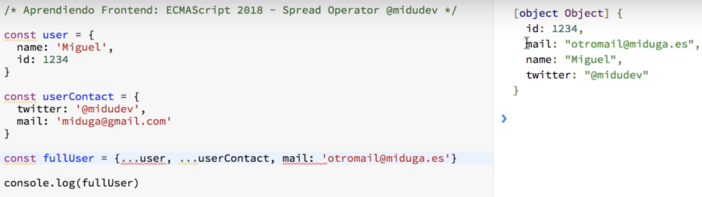

https://es.stackoverflow.com/questions/544238/duda-sobre-spread-operator-javascript

* https://youtu.be/0w_43KqOMt8?si=-h9Mz5gYxqHVeZV2
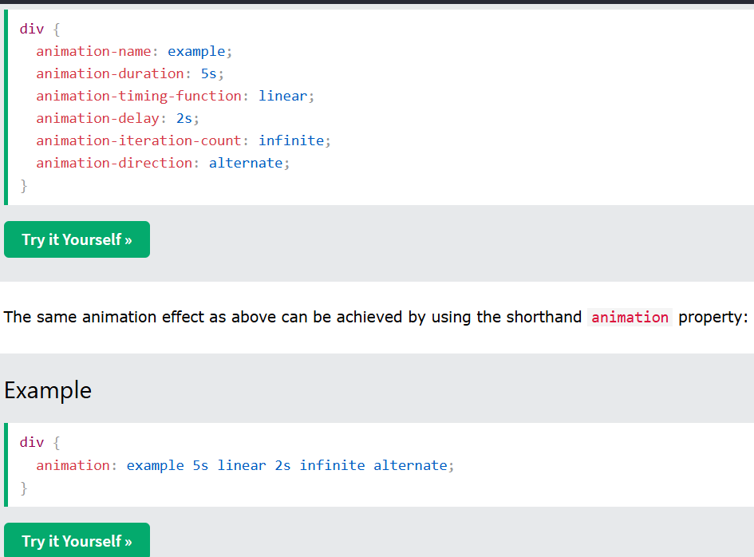

* https://youtu.be/qDBVg_NH-_w?si=z12zFqL7ZpHH14O7

useState 
* https://react.dev/reference/react/useState#updating-objects-and-arrays-in-state
> useState returns an array with exactly two values: The current state. During the first render, it will match the initialState you have passed. The set function that lets you update the state to a different value and trigger a re-render.
> useState is a Hook, so you can only call it at the top level of your component or your own Hooks. You can’t call it inside loops or conditions. If you need that, extract a new component and move the state into it.
* https://react.dev/reference/react/useState#ive-updated-the-state-but-logging-gives-me-the-old-value
* 
includes 
> determina si un arreglo incluye un valor específico
* https://developer.mozilla.org/en-US/docs/Web/JavaScript/Reference/Global_Objects/String/includes
contains
* https://developer.mozilla.org/en-US/docs/Web/API/Node/contains

* https://stackoverflow.com/questions/53606337/check-if-array-contains-all-elements-of-another-array
* https://stackoverflow.com/questions/24067259/filter-an-array-based-on-another-array
* https://stackoverflow.com/questions/45197817/filtering-out-an-array-based-on-another-array

> https://stackoverflow.com/questions/79691820/cant-filter-an-array-based-on-another-arrays-content

Estilos a checkbox
* https://desarrolloweb.com/articulos/estilos-css-campos-checkbox
* https://josetxu.com/aplicar-estilos-css-a-campos-radio-y-checkbox/
* https://codepen.io/josetxu/pen/gzdXVb
* https://es.stackoverflow.com/questions/600366/
* como-cambiar-el-color-y-forma-de-un-input-checkbox-en-html-cuando-sea-clickeado
* https://developer.mozilla.org/en-US/docs/Web/CSS/gradient/linear-gradient
* https://es.stackoverflow.com/questions/210529/como-hacer-para-que-container -ocupe-100-del-height-de-la-pantalla

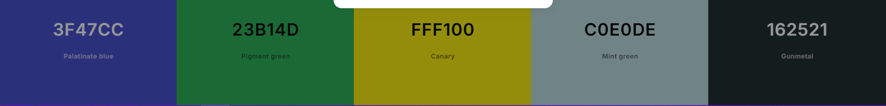
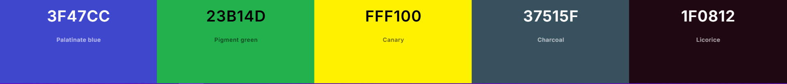
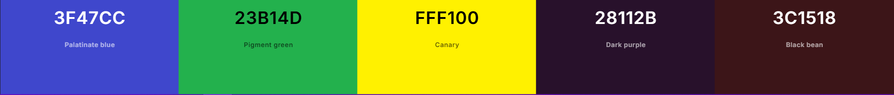
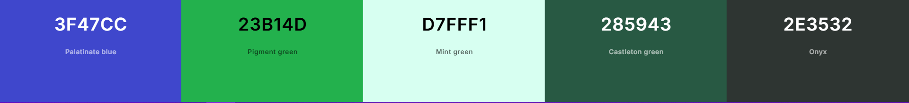

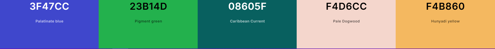
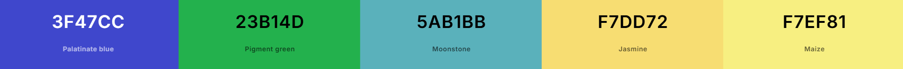
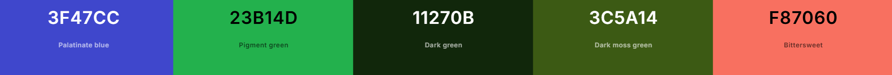

* https://developer.mozilla.org/en-US/docs/Web/CSS/border-image
* https://docs.fontawesome.com/web/use-with/react/add-icons
* https://www.wikihow.com/Share-Discord-Profile-Link

* https://dribbble.com/

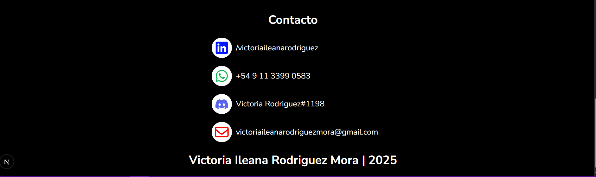

* [****](https://www.w3schools.com/css/css3_transitions.asp)

💜💡
transicion al aplicar filtros
mixin para flexbox
footer y header
rgb  conversor a # 
organizar code_notes
filtro por años
+400 de zoom
al hacer click en los filtros, que cambie el color de fondo de #filtros_input
separar logica de ui
font spartan
buscar patrones de flexbox y crear mixins