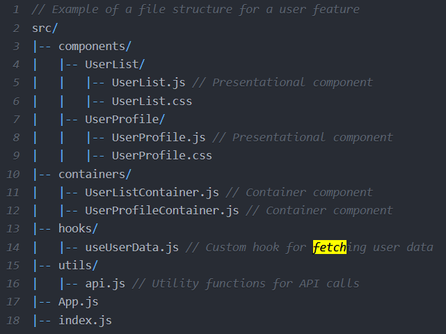

If you add absolute positioning to an element with display: inline-flex, it will become block-level (like display: flex), but will still generate a flex formatting context.

If you add absolute positioning to an element with display: flex, it will be sized using the shrink-to-fit algorithm (typical of inline-level containers) instead of the fill-available one.
[ref](https://stackoverflow.com/questions/41033245/does-position-absolute-conflict-with-flexbox)
[Abrí una pregunta en stackoverflow](https://stackoverflow.com/questions/79684809/flexbox-justify-contentspace-between-doesnt-work-properly-with-positionabsolu/79684870#79684870)

[text-decoration: none;](https://www.w3schools.com/css/css_link.asp)

### Filtros en JSX
https://youtu.be/94CVSF0Gr-w?si=m8wHy1c7KEDO_NXq

https://github.com/urian121/checkbox-filters-with-reactjs/blob/master/src/components/ApiProducts.jsx
https://www.dhiwise.com/post/mastering-the-art-of-separating-ui-and-logic-in-react 
https://codesandbox.io/p/sandbox/react-separation-of-concern-3vxv1?file=%2Fsrc%2Fhelper.js%3A6%2C1
https://stackoverflow.com/questions/69332889/reactjs-separation-of-ui-and-business-logic
