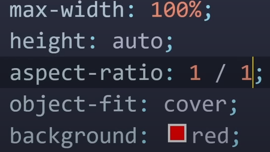
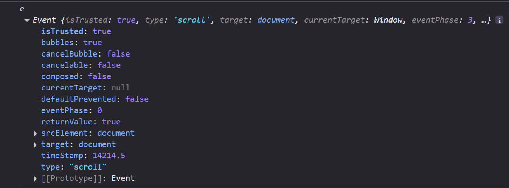

If you add absolute positioning to an element with display: inline-flex, it will become block-level (like display: flex), but will still generate a flex formatting context.

If you add absolute positioning to an element with display: flex, it will be sized using the shrink-to-fit algorithm (typical of inline-level containers) instead of the fill-available one.
[ref](https://stackoverflow.com/questions/41033245/does-position-absolute-conflict-with-flexbox)
[Abrí una pregunta en stackoverflow](https://stackoverflow.com/questions/79684809/flexbox-justify-contentspace-between-doesnt-work-properly-with-positionabsolu/79684870#79684870)

[text-decoration: none;](https://www.w3schools.com/css/css_link.asp)

### Filtros en JSX
https://youtu.be/94CVSF0Gr-w?si=m8wHy1c7KEDO_NXq

https://github.com/urian121/checkbox-filters-with-reactjs/blob/master/src/components/ApiProducts.jsx
https://www.dhiwise.com/post/mastering-the-art-of-separating-ui-and-logic-in-react 
https://codesandbox.io/p/sandbox/react-separation-of-concern-3vxv1?file=%2Fsrc%2Fhelper.js%3A6%2C1
https://stackoverflow.com/questions/69332889/reactjs-separation-of-ui-and-business-logic

Preguntas internas que he tenido que resolver/refrescar para continuar con el proyecto, dado que estoy adaptandome a NEXT.js sobre la marcha, siempre he usado create-react-app.

¿Cómo traía datos de una carpeta public?
Desde "/public"

¿Cómo se renderiza/recorre un arreglo?
Necesitaba indicar el return en el map

Necesito un context, porque necesito consumir de distintas partes la api

Necesito preguntar por el estado de los checkboxs, para realizar filtros.
| Formularios en React | Estado de inputs
Búsqueda: estado seleccionado de un input 
https://developer.mozilla.org/es/docs/Web/HTML/Reference/Elements/input#ejemplo_2_escenario_de_uso_com%C3%BAn

* https://es.react.dev/reference/react-dom/components/input
> Necesitas leer e.target.checked en vez de e.target.value para checkboxes.

* https://www.geeksforgeeks.org/reactjs/reactjs-checked-attribute/
> How React Handles the checked Attribute?
In React, form elements such as checkboxes and radio buttons can be controlled components, meaning their value (checked or unchecked) is controlled by the component’s state. Instead of relying on the static HTML checked attribute, React uses a combination of the checked property and state to manage the form element’s state dynamically.
In React, you don't simply use checked like in HTML. Instead, you tie the checked property of the input element to the component's state, which reflects whether the checkbox or radio button is selected.

* https://www.freecodecamp.org/espanol/news/a-continuacion-vamos-a-establecer-que-el-valor-totalprice-al-estado-total-utilizando-settotal-totalprice/
* https://codesandbox.io/p/sandbox/mystifying-tu-xlpgb?file=%2Fsrc%2Futils%2Ftoppings.js
* https://b8k2j.csb.app/
> En React, los Inputs Controlados se manejan mediante el estado, por lo que solamente podemos cambiar el  valor del input cambiando su estado.
> Antes, cuando teníamos un solo casilla de verificación, solo teníamos el estado isChecked para cambiar el estado de la casilla de verificación. Pero ahora, como tenemos varias casillas de verificación, no es práctico hacer varios llamados useState para cada uno.Entonces, declaremos un arreglo dentro del estado e indiquemos el estado de cada una de las casillas de verificación. Para crear un arreglo cuyo largo sea igual número de casillas de verificación

* https://stackoverflow.com/questions/68214703/filter-fetch-data-to-checkboxes-react-js
filter fetch data to checkboxes react js
* https://github.com/VictoriaIleanaRodriguezMora/ecommerce-react/blob/main/src/components/asynckmock.js

SPREAD OPERATOR

El resultado no varía

REST N OPERATOR
parametros:

Midu:
Copia por valor
 
Copia por referencia

Obj

Obj | Cambiar una propiedad

https://es.stackoverflow.com/questions/544238/duda-sobre-spread-operator-javascript

* https://youtu.be/0w_43KqOMt8?si=-h9Mz5gYxqHVeZV2

* https://youtu.be/qDBVg_NH-_w?si=z12zFqL7ZpHH14O7

useState 
* https://react.dev/reference/react/useState#updating-objects-and-arrays-in-state
> useState returns an array with exactly two values: The current state. During the first render, it will match the initialState you have passed. The set function that lets you update the state to a different value and trigger a re-render.
> useState is a Hook, so you can only call it at the top level of your component or your own Hooks. You can’t call it inside loops or conditions. If you need that, extract a new component and move the state into it.
* https://react.dev/reference/react/useState#ive-updated-the-state-but-logging-gives-me-the-old-value
* 
includes 
> determina si un arreglo incluye un valor específico
* https://developer.mozilla.org/en-US/docs/Web/JavaScript/Reference/Global_Objects/String/includes
contains
* https://developer.mozilla.org/en-US/docs/Web/API/Node/contains

* https://stackoverflow.com/questions/53606337/check-if-array-contains-all-elements-of-another-array
* https://stackoverflow.com/questions/24067259/filter-an-array-based-on-another-array
* https://stackoverflow.com/questions/45197817/filtering-out-an-array-based-on-another-array

> https://stackoverflow.com/questions/79691820/cant-filter-an-array-based-on-another-arrays-content

Estilos a checkbox
* https://desarrolloweb.com/articulos/estilos-css-campos-checkbox
* https://josetxu.com/aplicar-estilos-css-a-campos-radio-y-checkbox/
* https://codepen.io/josetxu/pen/gzdXVb
* https://es.stackoverflow.com/questions/600366/
* como-cambiar-el-color-y-forma-de-un-input-checkbox-en-html-cuando-sea-clickeado
* https://developer.mozilla.org/en-US/docs/Web/CSS/gradient/linear-gradient
* https://es.stackoverflow.com/questions/210529/como-hacer-para-que-container -ocupe-100-del-height-de-la-pantalla

* https://developer.mozilla.org/en-US/docs/Web/CSS/border-image
* https://docs.fontawesome.com/web/use-with/react/add-icons
* https://www.wikihow.com/Share-Discord-Profile-Link

* https://dribbble.com/

* [****](https://www.w3schools.com/css/css3_transitions.asp)

# ACCESIBLIDAD
Contenido | Fondo 541B5F - Borde D08AFF
* https://webaim.org/resources/contrastchecker/?fcolor=D08AFF&bcolor=541B5F

🟢 1. Texto normal (párrafos, ítems, botones, enlaces, etc.)
Qué opción mirar:
✔ Normal Text

🔵 2. Texto grande (mayor a 18px regular o 14px bold)
Qué opción mirar:
✔ Large Text

🟠 3. Bordes de elementos, íconos sin texto, y componentes UI (inputs, cards, botones sin texto, etc.)
Qué opción mirar:
✔ Graphical Objects and UI Components

Ratio requerido (AA y AAA): 3:1

Importante: este caso incluye:

Bordes de campos de formulario

Líneas decorativas importantes

Íconos sueltos (por ejemplo, solo el ícono de un lápiz para editar)

🟣 4. Fondo del elemento vs. fondo de la página
(Cuando un elemento no tiene texto, pero lo ves por el contraste contra el fondo)

Qué opción mirar:
✔ Graphical Objects and UI Components

Ratio requerido: 3:1

Ejemplo: una tarjeta con fondo azul sobre una página gris. Aunque no tenga texto, debe diferenciarse visualmente.

⚫ 5. Texto dentro de elementos con fondo
(Comparás texto vs el fondo directo que tiene debajo)

Qué opción mirar:
✔ Normal Text o Large Text (según el tamaño del texto)

Ratio requerido:

4.5:1 o 3:1 para AA

7:1 o 4.5:1 para AAA

⚪ 6. Borde del texto vs fondo del elemento
(Cuando usás texto con contorno, stroke o glow)

Qué opción mirar:
✔ Se considera ilegible por lo general.
✔ Se sugiere evitar y usar alto contraste de color plano.

Foreground: es el color del texto o del ícono o del borde que estás evaluando.
Background: es el color de fondo inmediato (del elemento, no de la página entera).

Pasan tarjetas con el fondo y viceversa

# ESTE
Azul tarjetas pasa con promocionada/cursando/pendiente. Falta letras blacnas en azul
VIOLETA con el fondo ok

* https://www.w3schools.com/css/css3_animations.asp
* https://developer.mozilla.org/es/docs/Web/CSS/CSS_transitions/Using_CSS_transitions

* https://nextjs.org/docs/app/getting-started/metadata-and-og-images
* https://www.dhiwise.com/post/mastering-nextjs-metadata-for-enhanced-web-visibility
* https://clerk.com/blog/how-to-customize-nextjs-metadata

agregar metadatos
icono sitio
* https://youtu.be/2IV08sP9m3U?si=yJzICCuZf1EJuApj

funcion min(fija rem, relativa al contenedor y aplica:%)
* https://www.w3schools.com/cssref/func_min.php

font-size
funcion clamp(minimo, preferido:vw, maximo) Va a usar el valor preferido mientras no se alcance al mnimo o máximo
* https://developer.mozilla.org/en-US/docs/Web/CSS/clamp
las unidades vw, vh, no son zoomeables, así si:
clamp(minimo, preferido: calc(vw + rem), maximo)

imagenes responsive

* aspect-ratio interesante

100vh - propiedad problematica
para corregir los espacios que se generan en mobile, usar 100dvh
escribir ambas maneras es buena práctica

menú hamburguesa
* https://youtu.be/m7YDWNz65iI?si=kGlp_SR266HdFK8-

¿Cuando usar cada unidad?
* https://www.freecodecamp.org/news/css-units-when-to-use-each-one/
### REM
Es recomendable remconfigurar el tamaño de fuente, ya que está diseñado para adaptarse a las preferencias del navegador del usuario. Esto facilita la accesibilidad
Usar rem"or em" para relleno o margen también ofrece ventajas, ya que proporciona un diseño escalable y fácil de mantener.
### %
Cuando quieres que un elemento ocupe una cierta cantidad del bloque que lo contiene, entonces debes usar porcentajes.
Establecer anchos y alturas en porcentajes también permite que los elementos se escalen en relación con el elemento que los contiene.
### VIEWPORT
vhTambién se puede usar para configurar tamaños de fuente que se ajusten a la altura de la ventana gráfica. Esto es útil para tipografía adaptable. 
### PX
La razón principal por la que pxno siempre se recomienda su uso en diseño adaptable radica en su carácter fijo. A diferencia de las unidades relativas, como los porcentajes em, rem, y las unidades de ventana gráfica ( vw, vh), pxno se ajusta según las preferencias del usuario ni el tamaño de la ventana gráfica.

pxes útil cuando desea especificar un tamaño fijo de un elemento, como el tamaño de un borde o el tamaño de una imagen.

* https://www.browserstack.com/guide/responsive-design-breakpoints

* https://nextjs.org/docs/app/getting-started/layouts-and-pages
* https://nextjs.org/docs/app/getting-started/layouts-and-pages
* https://nextjs.org/docs/app/getting-started/layouts-and-pages#pages
* https://nextjs.org/docs/app/getting-started/layouts-and-pages#layouts

* https://es.stackoverflow.com/questions/21572/como-puedo-detectar-el-movimiento-de-mi-scrollbar
* https://www.w3schools.com/jsref/tryit.asp?filename=tryjsref_onscroll2

* https://dev.to/duxtech/como-rayos-funciona-el-hook-useref-en-react-2lah
* https://developer.mozilla.org/en-US/docs/Web/CSS/:nth-child

* https://es.stackoverflow.com/questions/280764/agregar-transici%C3%B3n-a-la-aparici%C3%B3n-de-un-div
* https://stackoverflow.com/questions/40446658/javascript-add-transition-between-displaynone-and-displayblock
* https://sass-lang.com/documentation/at-rules/extend/
* https://developer.mozilla.org/es/docs/Web/API/Element/className
* https://coreui.io/blog/how-to-dynamically-add-remove-and-toggle-css-classes-in-react-js/#adding-and-removing-a-css-class-dynamically
* https://developer.mozilla.org/en-US/docs/Web/CSS/scrollbar-width
* https://desarrolloweb.com/articulos/detectar-resolucion-pantalla-usuario-javascript.html
* https://dev.to/israeldev_/usewidth-useheight-custom-hook-para-obtener-tamano-de-la-pantalla-1fe1

* https://stackoverflow.com/questions/55151041/window-is-not-defined-in-next-js-react-app

# HEADER RESPONSVE

💜💡
transicion al aplicar filtros
mixin para flexbox
footer y header
rgb  conversor a # 
organizar code_notes
filtro por años
+400 de zoom
al hacer click en los filtros, que cambie el color de fondo de #filtros_input
separar logica de ui
font spartan
buscar patrones de flexbox y crear mixins
organizar alfabeticamente las props
no usar px
boton para subir y bajar en la pag

hasta 370 ok
custom hook